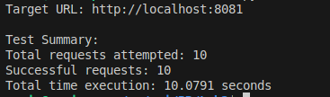
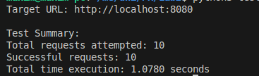
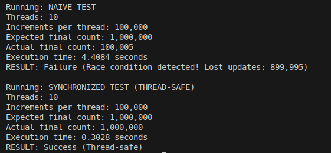
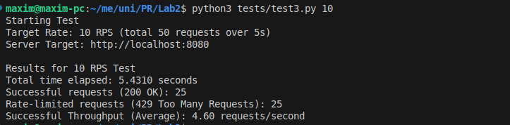
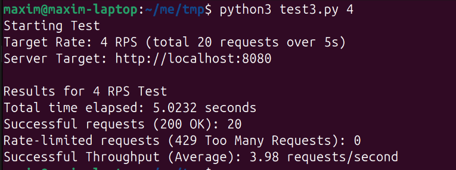

# Concurrent HTTP server
## Author: Isacescu Maxim FAF-231

---

## Source directory
```
LAB1
├── content // the folder which is being served
│   ├── books
│   │   └── ml-book.pdf
│   ├── index.html
│   ├── monalisa.png
│   └── pr.pdf
│
├── img // images for the report
│   └── teammate-connection.png
│
├── client.py
├── docker-compose.yml
├── Dockerfile
├── README.md  // report
└── server.py
```

## Docker & Docker Compose
```dockerfile
FROM python:3.9-slim

WORKDIR /app

COPY server.py .
COPY client.py .

RUN chmod +x server.py client.py

EXPOSE 8080

CMD ["python3", "./server.py", "/app/content"]
```

```yml
services:
  http-server:
    build: .
    ports:
      - "8080:8080"
    volumes:
      - ./content:/app/content:ro
    container_name: server
```
Note: There is a single server container, which also contains `client.py` in case you want to test without python access on the host.

## Quick Start
Script for starting the container: `docker compose up`
Script that runs server with directory as an argument: `CMD ["python3", "./server.py", "/app/content"]` (from `Dockerfile`)

Content folder structure which is served:
```
content
├── books
│   └── ml-book.pdf
│
├── index.html
├── monalisa.png
└── pr.pdf
```

## Implementation
- Single-threaded server (task 1):


- Multi-threaded server (task 1):


- Browser counter (task 2):


- Race condition (task 2):


- Rate limit (task 3):

  

